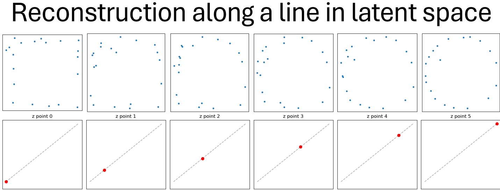
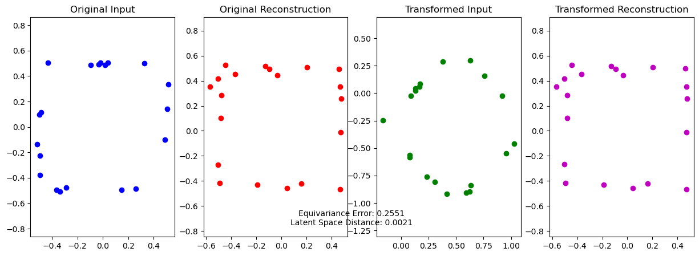

# EGNN-Based Autoencoder for Equivariant Representation Learning on Noisy Shapes



This repository demonstrates an autoencoder architecture built with Equivariant Graph Neural Networks (EGNNs) for learning rotation- and translation-equivariant representations of simple 2D geometric shapes, specifically noisy circles and squares.

## Objective

- Learn a 2D latent space where shapes are effectively separated by class (circle or square)
- Ensure the latent representation is equivariant to rotations and translations
- Reconstruct the original shape from the latent vector while maintaining geometric fidelity
- Visualize smooth transitions between shapes in the latent space



## Overview

This project includes:

- Synthetic graph-based datasets for noisy circles and squares
- An EGNN-based encoder-decoder model
- Latent-space visualization tools
- Shape reconstruction plots to evaluate geometric preservation

## Motivation

Many real-world tasks involve geometric structures that should not change under rigid transformations. In molecular modeling, robotics, and computer vision, equivariance to rotations and translations is essential. Here, we explore this concept with simple synthetic shapes, laying the groundwork for more complex datasets.

## Dataset Generation

Graphs are generated with 20 nodes:

- **Circles** (label = 0): Nodes sampled near a circle with radial noise
- **Squares** (label = 1): Nodes sampled along the perimeter of a square with noise

Each node has 2D coordinates and is connected to its 2 nearest neighbors.

```python
circle = generate_graph(label=0)
square = generate_graph(label=1)
```


### Model Architecture
  The core of the model is an Equivariant Graph Neural Network (EGNN) used in both the encoder and decoder.

### Encoder
  Accepts node coordinates (as features)
  Uses EGNN layers to build rotation- and translation-equivariant representations
  Applies global mean pooling to summarize the graph
  Projects into a 2D latent space

### Decoder
  Starts from a 2D latent vector repeated across nodes
  Initializes coordinates from a learnable template
  Reconstructs the node positions using EGNN layers

### Classifier
  Operates on the latent vector to predict the shape class (circle or square)

### Training

We train the autoencoder with a combined loss:

  Chamfer distance (soft variant) between reconstructed and target point clouds
  
  Cross-entropy loss for classification

A weighted sum of reconstruction and classification losses encourages both faithful shape recovery and meaningful latent representations.

    loss = alpha * chamfer_loss + beta * cross_entropy + correspondence_weight * soft_penalty

### Visualization

#### Latent Space

  Visualize how shapes are clustered in the 2D latent space

  Shows equivariance: different rotations map to the same latent representation

#### Reconstructions

  Plots original vs reconstructed shapes

  Illustrates how well the model preserves geometry

Demonstrates smooth transitions in shape across latent interpolations

### Results

After training, the model:

Clearly separates circles and squares in the latent space

Demonstrates equivariance to rotations and translations

Reconstructs geometries with high fidelity

Produces smooth transitions in shape when interpolating between latent codes

Requirements

    Python 3.8+
    
    PyTorch
    
    PyTorch Geometric
    
    Matplotlib
    
    NumPy

Install dependencies:

    pip install torch torchvision torchaudio torch-geometric matplotlib numpy

Run

# Train the model
    train_model()

# Visualize latent space and reconstructions
    visualize_latent(val_loader, model, epoch)
    visualize_reconstructions(val_dataset, model, epoch)

Future Work

Add more complex geometries (triangles, polygons)

Train on 3D point clouds with EGNN-3D

Extend to real-world datasets (e.g. molecules)

Add interactive latent space exploration

## Author

Cuauhtemoc Nuñez Valencia

If you're interested in collaborating or applying this technique to real-world problems (e.g., molecular modeling, physics-based simulations, medical imaging), feel free to reach out via LinkedIn or email.

License

MIT License

